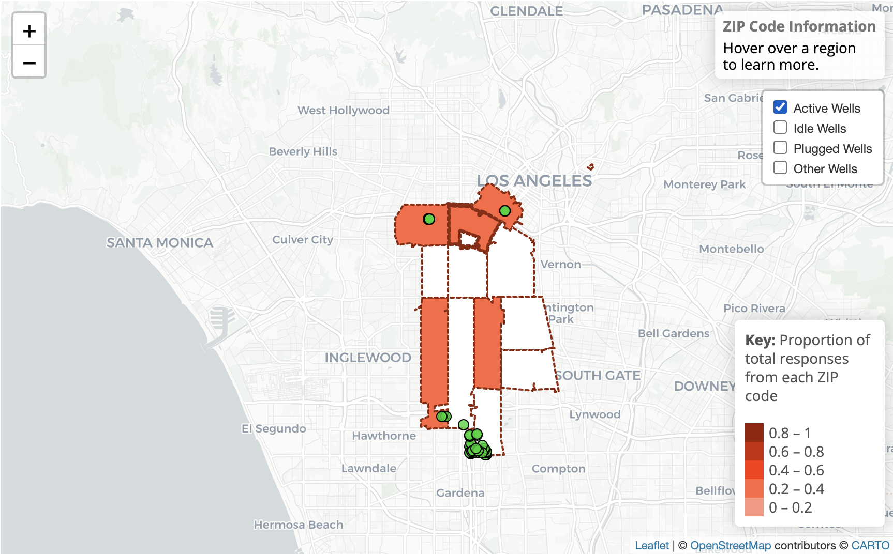
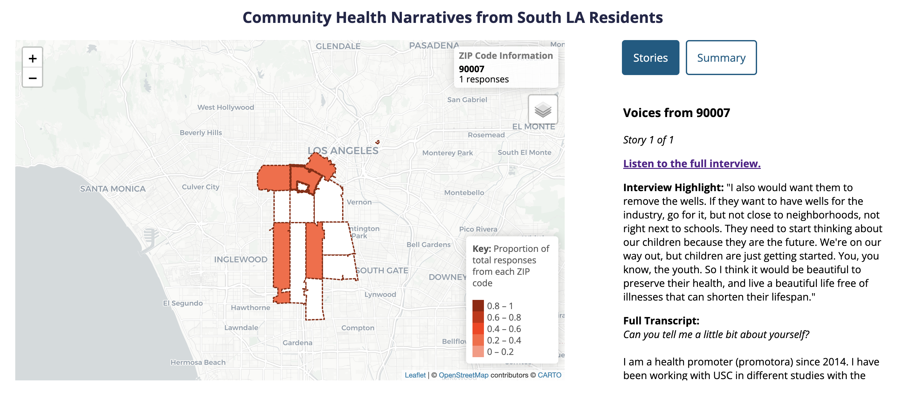

# mapping-our-stories
Showcasing community health narratives from South LA residents who live near neighborhood oil wells.

## Table of Contents
* [Objective](#objective)
* [Process](#process)
* [Technologies](#technologies)
* [Repurposing](#repurposing)
* [Features](#features)
* [Future Improvements](#future)

## Objective
How might we document the experiences of those residing near neighborhood oil wells and reinforce community power through democratizing technology? 

By working in coalition with community organizations such as STAND-LA, I created "Mapping Our Stories," an interactive mapping tool that showcases the personal health narratives of underrepresented people impacted by neighborhood oil drilling. 

My project involves community-engaged research, critical cartography & community archiving, and storytelling. I conducted informational interviews with leaders of community organizations and professors; led semistructured interviews with both Spanish- and English-speaking community members; and finally built an interactive mapping tool of community health narratives. 

This mapping tool is meant to provide the basis for a larger community archive that organizations such as SCOPE may choose to build on. My ultimate project goal was to develop a process for community organizations to have more consistency in terms of the information they collect - the building blocks of an accessible, interactive, and aesthetically-pleasing community archive. 

## Process
Mapping Our Stories involved a multifaceted process, starting from researching the issue of neighborhood oil drilling, to conducting outreach and informational interviews, to solidifying a community partner, to interviewing community members, and - finally - to building the final mapping tool. In my first quarter working on this project, the bulk of my time was spent defining the scope of my project. A critical part of this involved speaking to several community organizations and knowledgable professors - I really wanted my work to have tangible use, as my guiding theme of this mapping tool is to empower the community. To aid in this goal, I was able to work with Ruth Andrade (a community leader and organizer for SCOPE), who provided me with useful feedback throughout the process and connected me with several community members who were willing to share their stories. 

I collected a total of five interviews as part of this project, and I hope that community organizations with more time and resources can continue this work. Three of these interviews were conducted in English, and two were conducted in Spanish with simultaneous translation (with help from translator Lluvia Cardenas). Interviewees were first given a description of the project and were told to sign a release form, allowing us to publish the audio and transcript of the interviews. All interviews were recorded using a mobile phone. For interviews conducted in Spanish, two phones were used to record both the Spanish responses and English translations (which Lluvia provided simultaneously). The interviews were conducted in-person in a semi-structured format, with a pre-prepared list of questions that I loosely referenced for the sake of consistency across interviews. Having a semi-structured format allowed the interviewees to guide the interview in the direction they best saw fit, encouraging them to tell an authentic story that best represented their experiences. Interviews lasted approximately 20-50 minutes long, depending on how much information each interviewee wanted to contribute. At the end of the interview, each interviewee was given a $40 Visa giftcard and a thank-you note out of gratitude for their time and labor. 

I then used Microsoft Word's built-in transcription function to create an initial transcription of each interview. I then carefully listened to each interview in full and edited the auto-generated transcription accordingly, making small adjustments for clarity and highlighting portions that stood out to me. Names and personal identifying information such as addresses were edited out of the interviews. Since I am not a Spanish speaker, I was unable to transcribe the two Spanish recordings. 

This mapping tool is linked to an external Google Form that community organizations can use to document interviews. The form collects ZIP code information, the full interview transcript, an interview highlight (a particularly insightful sentence or two from the interview), and a link to wherever the interview recording is stored. Upon submission of the form, the interview should automatically appear on the map according to the ZIP code information collected. This is meant to streamline the process of populating the map and uploading interviews, requiring minimal coding/backend knowledge. Basically, the code processes all data collected in the Google spreadsheet tied to the form. Note that any text modifications (i.e. italics and such) must be written in HTML format so that it appears correctly on the website. For example, I used the "<em>" tag to italicize all questions/comments made by the interviewer to improve readability. All data can be directly modified after submission through the Google spreadsheet linked to the form, and the map will update automatically as soon as this data is saved. 

## Technologies
To increase accessibility, I used free, open-source hosting on GitHub Pages for this website. To write the code, I used VSCode with Git integration, referencing template code and processes from a <a href="https://albertkun.github.io/23S-ASIAAM-191A/">Web Dev and GIS for Social Change course</a> taught by Albert Kochaphum at UCLA (the linked course website details the complete process of building an open-source mapping tool from scratch, with publicly-available template code). HTML was used to build the website's framework, CSS was used for styling purposes, and JavaScript was used for most of the website's dynamic functionalities and mapping. I also incorporated Leaflet.js, a JavaScript package that aids in open-source mapping. 

Interviews are uploaded through the submission of a Google Form. The map draws from data stored and accessed through the connected Google Sheets, which uses Google Scripts to geocode latitude/longitude coordinates from locations submitted through the Google Form. PapaParse was used to manage and process this data on the backend, within JavaScript. 

Interviews were roughly transcribed using the transcription feature on Microsoft Word and were then manually transcribed in detail. Interview recordings are currently stored on Google Drive for ease of access. 

## Repurposing
Community organizations and community members can use any of the components of my project as they see fit. 
- Database of interviews
    - All five interviews have been transcribed (in English), and both the transcription and recordings are stored within Google Drive. 
    - The interview process has been documented, setting up a basic structure for community organizations to continue my work as they see necessary. 
    - Interview questions and release forms are accessible through Google Drive.
- Open-source mapping tool
    - All code is publicly available on GitHub for community organizations to build off of or reference. Code can be edited to include additional features and/or change existing features. 
    - GitHub Pages is a free hosting tool accessible by anyone - the mapping tool can remain publicly available without the need for subscriptions and without incurring additional costs. Since the entire website has been coded from scratch (rather than relying on templates or external paid services), it can be fully customizable according to the community's needs. 
- Accessible interface 
    - To populate the map, all one needs to do is submit a Google Form with the appropriate interview information. Upon submission, the interview will be automatically mapped according to ZIP code information. This means that the mapping tool can be maintained and used without any intensive coding knowledge. Coding would only be required if community organizations would like to edit existing features or add additional features. 
    - My process is fully documented here to aid community organizations in continuing my work. I have also shared a Google Drive folder with all relevant documents/files. 

## Features
- Popup
  - Loads upon arriving on the site, providing important context and information for the user before they begin navigating. 

- Map Functionalities
  - Choropleth map of nearby zip codes, based on proportion of total responses from a given zip code. 
  - Hovering displays of response counts 
  - Clickable zipcodes population of side panel 

- Map Side Panel 
  - Stories tab: scrollable list of all stories collected from respondents in a selected zip code. 
  - Summary tab: visualizations of aggregated information from respondents in a selected zip code, including demographics breakdown and sentiment overview. 

## Future Improvements
- Spanish translation/transcription
- Carousel view of stories
- More streamlined ZIP code mapping